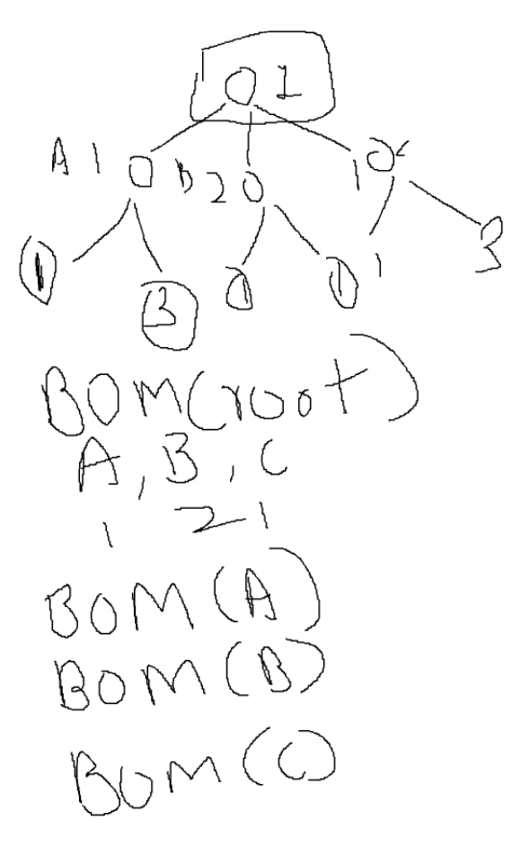

#  Why did we choose a recurcive CTE with postgres for bom explosion vs a normal naive approach using golang — Technical Design

**Author:** 
**Date:** 2026-97-29
**Status:** Implemented

## 1. Summary
- 

## 2. Goals / Non-Goals
- **Goals:** what this design is meant to achieve
- **Non-Goals:** explicitly out of scope, to prevent scope creep

## 3. Background
In order to calculate the mrp i.e generate relevant production orders, work orders and other kinds of orders for a production plan.
bom traversal is required. bom is shortform for bill of materials.

- here is an example of BOM for a table lamp.
- Table Lamp
    - 1 Bulb Socket.
    - 1 Lamp Stand
        - ..
    - 1 Lamp Base
        - ..
    - 6 Screws

- Now lets say we need to make 100 table lamp. naturally, we would need 100 bulb sockets because in order to make 1 table lamp we would need 1 bulb socket.
Now, Is bulb socket a make item [which means we produce it in house] ? Items can be either make or buy ? if its a make item. Then we have to further check its BOM [materials needed to make that particular item]

- 

- Imagine traversing a tree through DFS. 

## 4. Proposed Design
The core of the doc. Architecture diagram, data flow, components involved,
key interfaces/APIs, data model changes. Go into as much detail as future-you
would need to rebuild your own understanding from scratch.

## 5. Alternatives Considered
Same as ADR — options you evaluated and why you didn't pick them. Even
for personal docs, this is often the most useful section later, since it's
easy to forget why you ruled something out.

## 6. Trade-offs & Risks
- Performance, cost, complexity trade-offs
- Known risks and how you're mitigating (or accepting) them

## 7. Insights
- Anti Pattern N + 1 queries.
    - You need to perform recursive processing, inside the recursive processing if you call database. the overhead for calling the database increases. 
    - So having a database query inside a recursive loop might make the app slower than it needs to be.

- Why is it a problem or where actually the problem lies 
    - So when you call a db few things happen. and it always as a fixed cost.
        - Cost for network round trip.
        - Cost for establishing tcp connection if its not pooled correctly.
        - Cost for db actually running the query 
        - Cost for serializing and deserializing.
    
    - Lets say even if a individual query is quick 2ms. In a recursion there might be 1000 nodes.
    each of that node calling the db will pile up.

    - You get a fixed number of connections from your pool. 
    If a recursion implementation is not properly executed or the structure of tree is too deep or wide.
    there are chances that you will exhaust your connections and will result in a failure.

- What to do instead
    - Fetch upfront, recurse in memory — query all the data you'll need in one (or a few) batched queries before starting recursion, build an in-memory structure (map/tree), and recurse over that.
    - Batch/bulk queries — use WHERE id IN (...) or similar instead of one query per item.
    - Use recursive SQL (CTEs) — if the recursion mirrors a hierarchical structure already in the DB (e.g. org chart, category tree), a recursive Common Table Expression can let the database do the traversal in one query instead of your app code doing it query-by-query.
    - Caching/memoization — if the same records get queried multiple times across recursive calls, cache them for the duration of the operation.

